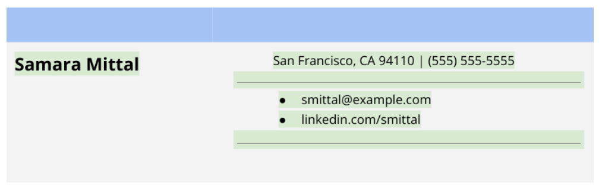

# Career Resources 
#### Learning Objectives 

- Research desired career path
- Analyze job skills and transferable skills
- Create a Resume and Cover Letter
- Create a job search plan
- Prepare for job interviews 

## Seeking a New Career or Advancement 
### Finding your Path and Perfect Role

As you begin your career, you'll have to navigate you way to find the perfect role for you. While there is no one way tp find your ideal role, there are some things to consider tp help you better understand what direction you want to take. 

#### Generalist vs specialist 

One category to consider when attempting to find your right path is whether you want to work as a generalist or a specialist. A **generalist** is knowledgeable about many topics and has various interests, while a **specialist** is an expert in a specific field. 

Generalists have broad, multifacted roles that allow entry-level employees to gain invaluable experience in many different areas related to the field. Alternatively, specialists are focused on a singular aspect of the field.

#### As you navigate your job search, think about what you want in a career. Establish the types of roles you want to start with and the type of company you want to work for. Over time, your experience will help you make better-informed decisions related to your career direction. 

## Diversity and Inclusion

In the simplest terms, diversity means something that is different from the norm. Diversity in the workplace represents how organizations and their employees connect, engage, and respect people across all types of differences. More companies are beginning to emphasize their Diversity, Equity, and Inclusion (DEI) metrics as a way to stand out from their competitors. Companies with good DEI metrics tend to have higher employee retention rates, more satisfied employees, and increased innovation.

Diversity starts at the very top with a company’s executive leadership. Examine the leadership at the company you want to work for. The people working at the executive level is typically a good indicator of how diverse and well-represented their employees are as well. If a company’s executive leadership does not embrace diversity, the employees will experience greater difficulties in creating and maintaining that culture. Some questions to ask yourself as you are conducting research on companies:

- Does the company share their progress openly? 

- Do they provide education and training opportunities to learn more about DEI and how people in the workplace are impacted? 

There are several ways to assess whether or not a company practices diversity and inclusion. Here are a few resources to explore and gain better insights on the company:

- The company’s website. Assess their core values, history, mission statement, and keywords. See if their website includes any photographs of their employees. 

- Their social media page(s). What kind of pictures and content do they post publicly? Check for photos of their employees, community outings, whether or not they recognize or celebrate various events or historical moments such as pride month, black history month, or world mental health day as a couple examples.

- Interview former employees. Conduct informational interviews to learn more about a company in general and ensure that workplace culture will be a good fit for you.

### Unconscious/Implicit Bias

Unconscious or implicit bias refers to the attitudes, stereotypes, judgements, or prejudices that we have unconsciously in our brain. This bias makes our reactions, thinking, and predisposition to information, actions, or environments alter in a particular way, whether it be positive or negative, without self awareness of its occurrence. It occurs beyond our control and could impact our decisions, actions, and understanding. 

Unconscious bias is present, to some degree, in every single person and is developed from an early age through the course of one's life. Unconscious bias is associated with many characteristics such as race, ethnicity, gender, religion, sexual orientation, socioeconomic background, and educational background. Some of the common types of unconscious bias are:

- Affinity bias, which refers to preferences when choosing people to connect with. These people share similar interests, experiences, and backgrounds to your own.

- Attribution bias, which refers to the ways you perceive your actions in comparison to others. This bias is mostly in association with how you perceive success and failure.

- Ageism, which refers to negative feelings or discriminations against someone based on their age.

- Beauty bias, which refers to relating a person's physical appearance to their success, competence, and/or qualifications.

- Gender bias, which refers to a preference for one gender over others.

- Ableism bias, which refers to perceiving able-bodied people as the norm and people with disabilities should strive to perform at the same level as able bodied people without necessary accommodations. (examples: reserving a meeting space that is not wheelchair accessible, assuming people have to have a visible disability to be considered disabled, framing disability as something tragic or as an inspiration)

In order to identify our own biases, it’s important to know what are some of the causes of unconscious/implicit bias. Bias occurs because, as human beings, we are susceptible to tendencies and are creatures of habit. For example: humans tend to seek patterns, our brains are known to simplify the world, we get influenced by culture and/or media.

The truth is that no matter what the causes are, we are susceptible to implicit bias, and this could affect our relationships at work, the way we behave on certain occasions, the decisions we make, and how we react in our work environment.

The first step that we can take to remediate this behavior is to recognize that we are susceptible to bias and to identify it. The next step is to take actions that reduce the implicit bias at work. Some corrective measures that can be taken are:

- Increasing education. Educating employers and employees about the different types of unconscious bias and how to recognize it is one of the most effective methods to reduce this bias at work.

- Creating an inclusive work environment. Having an inclusive work environment will help to broaden perspectives and balance any prejudices.

- Taking into account the types of bias when making decisions. Check your decision for any cultural, racial, ability, or gender stereotypes.

#### We are all human, each with our own thoughts and opinions. It is important to recognize we do not all think the same way. Unconscious/Implicit Bias is an unavoidable result of being human and can influence daily decisions in our personal and professional lives. Make sure to be conscientious about unconscious/implicit bias when in the workplace by being open minded. A culture of diversity, equity and inclusion starts with executive leadership in any organization. Continuous education and training is very important and effective for reducing bias at work and promoting a culture of diversity, equity, and inclusion.

## Creating a Career Development Plan

There are several components and aspects of your potential career to consider while you are job searching. Before embarking on your journey, it is important to outline your career path. Doing so will help you find opportunities that align with your values, interests, and aspirations. As a Python automation developer, you have a myriad of options available to you. Many industries are hiring IT professionals to assist with Python development, debugging code, troubleshooting issues, recommending solutions, and automating processes on cloud platforms and in Linux environments.

### Identifying career goals

**What do you want to accomplish as a Python automation professional?** There are multiple specialist fields in the IT industry that will give you the opportunity to further develop and hone your skills in automating with Python. However, you can just as easily take the generalist route and cross-apply your knowledge of Python, cloud computing, and Linux to various roles. 

**Do you aspire to eventually work in management in any capacity?** If so, it’s important during your job hunt to ask about opportunities for advancement or transition throughout the company. Some companies are limited in opportunities due to long-term employee retention or other factors.

**What are your unique strengths and skills that you bring with you to a company?** Identifying your strengths, both soft and hard skills, will help you stand out from other applicants. There are a plethora of transferable skills that you can use to leverage your application. If you’re not sure where to start on identifying your unique strengths and identifying your transferable skills, there are lots of online resources and platforms to help you get an idea. 

Skill stacking is becoming more appealing to hiring managers and companies within the field of technology. Skill stacking is when employees combine skills from different fields or industries to produce novel ideas, approaches, and systems. Soft skills are the most important skills to have if you’re considering any position in management or if you want to work in a team-based work environment. Having the skills to hold conversations, navigate conflict, and collaborate with others will highly benefit your career.

### Creating a timeline

A common question that is asked in interviews is, “where do you see yourself in 5-10 years?” Creating a timeline for you and your career is helpful in gaining insight into what career opportunities will work best for you moving forward. One helpful way to gain clarity into this is to break down your bigger career goals into smaller goals.

Approach your job search and career in IT with an open mind. Be flexible with deadlines, milestones, and your own personal timeline. Be receptive to potential job opportunities that you might not traditionally apply to or pursue. Adaptability and flexibility are two of the most coveted soft skills employers look for in their employees. 

Lastly, hold yourself accountable for your own progress. Technology is always changing and staying informed of all the changes that pertain to your job or specialty will give you an advantage over other employees. Look at taking other certifications, take online courses, read books on the subject, attend conferences, continuously network with other professionals in your field, and/or complete passion projects in your free time. Taking extra measures to inform yourself about your field and attending events with other professionals will greatly increase your chances of success and career satisfaction.

### Getting Promoted

You may already have a technical job and are building your skills to advance your career. You may be considering asking for a promotion.

You know that you have the Python and automation tools to successfully advance your career. Now is the time to plan for what to do next, with special consideration as to which career path to pursue. Perhaps you're interested in using your Python skills for analyzing data or developing software. You might be considering using your automation knowledge to streamline the maintenance of a Linux network or cloud environment. 

What are the growth opportunities in your organization? Do they support training? Is this a transitional job? Is this your dream job? All these questions must be taken into account when planning your next steps. After you answer those basic questions, you have to prepare and space your next steps accordingly. If you are planning to grow within your organization, there are a few considerations that you should evaluate to get to the place where you want to be.

The first thing to consider when planning for a promotion is performing beyond average at your current position. This means proving to your employer that you are not only capable of doing your actual job, but that you are capable of taking on bigger responsibilities. How do you achieve that?

- **Work on your development.** You should always do your best to excel in your job. You can stand out from the crowd by adding value to your contributions to the company. How are you improving efficiency, saving money, bringing in new revenue? To get a chance at that promotion, you need to be the employee that gives more every day, willing to take new responsibilities.

- **Show leadership and be a team player.** Showing that you are a team player and can take leadership roles will help you to get noticed by your employer. Strive to be a role model, gain your coworkers respect, and motivate your team members. In other words, display and build qualities that will make you a good leader.

- **Continue your education.** When developing your career path, consider and plan for future certifications and training. For example, if you are planning to get from Python coder to Data Analyst, plan to earn a new certificate, like the Google Data Analytics Certificate. Check for your company’s Data Analyst job requirements and improve your skills accordingly. 

- **Maintain strong work ethics.** Always be punctual for work, have excellent customer service, meet your deadlines, excel at your job, be respectful, and collaborate with your coworkers.

- **Communicate with your boss, your coworkers, and your customers.** Good communication is a key characteristic to display in any type of job, but when you are looking for a promotion, you need to excel in the way you communicate. It is crucial to know how to communicate. It will help when planning for your career path and add some communication training to your skill development.

#### Planning for a promotion doesn't necessarily mean that you are going to get one. Sometimes you will need to ask for it, or change roles or organization in order to achieve it. However, to be ready and able to demonstrate your value as part of an organization, remember to:

- Work on your development.

- Show leadership and be a team player.

- Continue your education.

- Maintain strong work ethics.

- Communicate with your boss, your coworkers, and your customers.

## Preparing Your Resume

### Tailor you resume

As you prepare for your job search, you will need to create or update your resume to reflect your experience in order to apply for roles like: 

- Automation Engineer

- Entry-level Python Developer

- IT Support Specialist II

- Entry-level Software Engineer

- Network Engineer

- …and other similar job titles

You have learned so much during this certificate program, and it is important that your resume reflects that. An effective resume highlights your skills and experience and is tailored to the position you are applying for. Let’s explore how to make your resume stand out by incorporating your new Python automation skills and your previous experience. 

### Tailor the content
- **Identify what is important to the potential employer.** What does the employer want to know about you? Make sure that you carefully read the job description and notice which skills are mentioned. You can also read several job descriptions for the same type of role to identify which skills and requirements show up frequently. For instance, although specifics will vary by role and employer, many Python automation-related roles require the ability to effectively organize and coordinate across teams and projects, manage multiple tasks simultaneously, and communicate effectively. You should take note of these skills and be sure to highlight them using similar terms on your resume. 

- **Create one primary resume to edit and tailor to each job application.** You should make sure that the order of your skills and qualifications matches the job description. In doing this, you are making sure that the things that are most important to the employer are at the top. 

- **Match the language used in the job description.** Some employers use automation software to filter resumes. If the job description uses keywords like cloud services and risk management, make sure your resume uses those keywords, too. 

- **Use Python automation terminology.**  This will help the hiring manager reading your resume understand how your past experience is relevant to the role for which you are applying. 

- **Decide what not to include on your resume.** You may have some skills that are important to you, but those same skills may confuse or distract the hiring managers reading your resume. 

- **Highlight how your experience and skills are relevant to the job.** If you have been working as an IT Support Specialist but want to become a Python Automation Engineer, your troubleshooting skills will be essential in your new role. Make sure to point out how those skills will be beneficial to the employer. 

### Choose an appropriate format

No matter what layout or template you choose for your resume, there are several things you should keep in mind.

- The design of your resume should be simple and easy to understand for both human and artificial intelligence readers. You don’t want your resume to be discarded before a real person has a chance to read it! 

- Your resume should be easy to read and communicate all of the important information in short bullet points. 

- Your resume should be one- to two-pages long and contain only the last ten to fifteen years of relevant experience. It is appropriate to use two columns on a one-page resume, but if your resume is two pages, be sure to use the entire width of the page. 

### Update the relevant sections

Once you have determined the appropriate format for your resume, you will need to update each of your resume’s major sections, which include:

- Contact information

- Professional summary

- Core competencies

- Professional experience

- Education and certifications

**Pro tip**:  Resumes should be written in the third person and should not contain personal pronouns. 

Let’s discuss how to incorporate your new skills into these sections of your resume.

#### Contact information
Your header should contain your contact information and should go at the top of your resume. 

- **Your header should include the following information:**
    - Your name in a larger font than the rest of your resume
    - The city and state you live in (you do not need to include your street address for privacy purposes)

    - Your phone number and a link to your email address

    - Link to your LinkedIn profile URL

    - Links to any other personal websites or portfolios, if applicable to the role you are applying for

- **Your header should be relevant, simple, and easy to read.** Here is an example of a resume header:

### Professional Summary

Below your header, include a professional summary.

- **Use your summary to set the tone.** Your summary should be one to three lines and should clearly state why you are the best candidate for the position. It should showcase the most important things you want the reader to know about you. If you are applying for a new role, you will want to update your industry specialty. You likely have experience that can be related to critical thinking and complex problem solving. You will want to incorporate that relevant experience into your new professional summary. Make sure you tailor your description of yourself to the role you are applying for. 

- **Merge the description of the role you are applying for with your experience.** Here is an example: 

    - Automation Engineer with two years of demonstrated success in complex problem solving. Skilled in cross-functional collaboration and project execution. Articulate communicator who thrives in a results-driven collaborative environment.

- **Use keywords from the job description to describe yourself.** If the job description states that the company is looking for a candidate with knowledge of cloud computing, Linux, or Bash scripting, you should add that to your resume—you have gained that knowledge with this certification.

Once you have your professional introduction, your next sentence should describe how your unique expertise will make you valuable to the employer. 

**Pro tip:** Don’t forget to use this section to highlight something that makes you stand out from other applicants. Use an accomplishment from a previous role to show the employer what you can offer them. Take a look at this example of a professional summary section:

Now that you have your heading and professional summary updates, let’s move on to the core competencies section of your resume.

### Core competencies

Your core competencies should be a bulleted list of the most relevant skills applicable to the position you are applying for. 

*Pro tip: Scan the job description for core competencies you have gained during this certification and your past experience then use those skills as bullet points in this section. Make sure to keep this section relatively short, with four to eight bullets. Here is an example of a Python Automation Engineer resume core competencies section:

](week5-images/week5-core-competencies.png)

Now that you have showcased who you are and what makes you the best candidate for the job, it is time to tell the story of what you have accomplished throughout your career in the professional experience section.

### Professional experience 

Your professional experience will not change much from previous resumes, because you can’t change the past roles you have held. However, you can possibly rewrite some of your bullets to relate them to your target job’s requirements. Make sure you are tying the industry lingo back to your previous experience to show the reader—usually a hiring manager—how your skills relate to the advertised position. You may be able to use terms like troubleshooting, critical thinking, testing, implementation, and software maintenance to show the reader that your past experience translates to a Python Automation or Software Engineering role, for example. 

Pro tip: Make sure your resume conveys how your past accomplishments are valuable to the role you are applying for. Show the reader how you can make a difference in their organization. An easy way to remember this is through the P.A.R.I.S. framework:

- **P**roblem that needed to be solved
- **A**ction(s) I took
- **R**esult of action(s) 
- **I**mpact on project (users, quality, etc.) 
- **S**upporting evidence (awards, bonus, etc.) 

Below is an example of a professional experience section from a Python Automation Engineer’s resume: 

### Education and certificates 

Now that the majority of your resume has been updated with your new skills and knowledge, it is time to update your Education and Certifications section. In this  section of your resume, you should include any degrees beyond your high school diploma in reverse chronological order. For each degree, list the degree you earned, institution, location, and date of graduation. This section should also list any professional certifications, licenses, or credentials you hold. It is here where you will list your new Google Professional Certificate. Here is an example of an education and credentials section of a Python Automation Engineer resume:

](week5-images/week5-education.png)

Your resume is now updated and ready to use for your target job! You have revised your professional summary, added newly-acquired core competencies, related past professional experience to your target position, and added this certification to your resume. 

Pro tip: It is always a good idea to have someone review your resume for any spelling or grammatical errors. Recruiters and hiring managers often toss resumes aside that contain typos. Once you are sure your resume is error-free, it is time to start your job search! 

### Writing a Cover Letter

A cover letter is a personal introduction to promote yourself. It serves as a companion document to a resume. Its main purpose is to elaborate on your professional skills, motivations, and why you should be viewed as the best candidate for a job.  

There are three types of cover letters: 

- **Networking**—Addressed to individuals to ask for their help in finding a job at their company

- **Prospecting**—Addressed to companies to explore all open job opportunities

- **Application**—Addressed to hiring managers to emphasize your fit for a specific job

This reading focuses on helping you write application cover letters. Employers have “who, what, where, when, why, and how” types of questions when they gather information about job applicants. 

Your resume answers:

- **what** you have done 
- **where** you worked
- **when** you were employed. 

Your application cover letter describes in more detail: 

- **who** you are
- **why** you want the job
- **how** you will be successful in the role

### Preparing to write a Cover Letter 

**Pro tip:** Not all job applications require a cover letter. When a cover letter is stated as being optional, it’s best to consider how much a cover letter might improve your standing. The following are common situations when people prefer to include a cover letter:

- When starting out in a career (early career applicant)
- When making a career transition
- When experience, education, or training isn’t an exact match with the listed requirements
- When entering a crowded field of applicants

Many people agree that no cover letter is better than a poorly written one! Even if a cover letter has no obvious errors, submitting a few paragraphs with very general statements isn’t going to help you that much. Before you write a cover letter, follow these steps to ensure you create a meaningful one. 

**Step 1: Research the company or organization**

You can find out a lot about a company from these methods:

- Browse the company’s website
- Follow the company on social media including LinkedIn
- Perform a search on the company’s financial standing and investors, if applicable
- Perform a search on the company’s known competitors
- Ask your relatives, friends, and colleagues what they know about the company

**Step 2: Inventory the required skills from the job description**

Read the job description carefully and determine what you think are the most important skills for an applicant to have and why. 

**Step 3: Prioritize your matching skills from strongest to weakest** 

Based on the skills you identified in the previous step, identify your skills that match or are most closely aligned (associated) with them. Next, prioritize your matching skills from the strongest to the weakest. People often skip this ordering process. Ranking your skills enables you to emphasize your strongest skills first in your cover letter. 

### Parts of a Cover Letter

**Pro tip:** A cover letter is between 250-400 words in length and doesn’t exceed one page. 

Review the goals for each section of a cover letter below. 

**Introduction**

The primary goals of the introduction section of a cover letter are to:

- Identify the position you’re applying for
- Show your enthusiasm for the company
- Encourage people on the hiring team to learn more about you

**Example** I’m applying for the Python Developer position, and can’t imagine a more exciting role. As a frequent and avid user of your services, I’m eager to pursue this career opportunity.   

**Body Section**

he goal of the body section of a cover letter is to describe how your skills apply to the open position. Suppose the job description has these qualifications:

- Experience with Python scripting

- At least 1 year of IT troubleshooting experience

-Critical thinking skills with ability to solve complex problems

The following example shows how you can map your experiences to these qualifications in the body of your cover letter. 

**Example** 

I completed the Google ____ Professional certificate and have previous customer service experience in retail electronics. I was responsible for helping customers choose the right devices for their needs, and solve any problems they had with those devices. I also helped keep the onsite computers healthy by identifying and solving any technical problems. With my attention to detail, I can help your IT team solve problems quickly and efficiently.

**Pro tip:** Avoid the temptation to rehash the content of your resume. A warning sign is if your cover letter has essentially the same information as your resume but in a paragraph format. 

**Pro tip:** Focus on what you can do for the company rather than on how you would benefit from being hired for that position. The difference between being company-focused and self-focused can be subtle, as in the following sentences:

- I would like to develop automation solutions to keep your company’s IT structure solid and provide efficiency to the company’s IT systems **(company-focused; what you will do for the company)**.
- I would like to grow my Python skills by developing cloud automation solutions for efficient virtual machine management **(self-focused; what you would like to gain by being in the role)**.

**Example** 

Thank you for taking the time to review my resume for this position. I’m confident I can excel in this role using my combined work experience and skills from the Google ____ Professional Certificate. I’m looking forward to an interview and request the privilege to follow up on my application’s progress in the coming weeks.

### Proofread your Cover Letter

Many errors in cover letters are caused by copying and pasting text from one cover letter to another. After you write your cover letter, proofread it carefully to catch these common things:

- Awkward formality—Few people call people Sir or Madam nowadays, so you shouldn’t use these in your cover letter either. Also refrain from using “To whom it may concern” which sounds highly impersonal. If you don’t know the name of the hiring manager, use “Dear Hiring Team.” Likewise, consider using “Best regards” instead of  “Sincerely” which sounds a little outdated.

- Misspelled words (especially those that sound the same but are spelled differently). For example, “affect” and “effect,” “then” and “than,” and “your” and “you’re.”

- Mismatched skills—Make sure you aren’t incorporating skills for the wrong job description in your cover letter. This happens with copying and pasting.

- Passive voice—Use active voice whenever possible: “I revised the ads” instead of passive voice: “I ensured that the ads were revised.” 

- Long anecdotes—Save stories that describe any past results you achieved for when you are  being interviewed.

#### Cover letters help introduce the best points about yourself to a potential employer. Make sure that your cover letter doesn’t simply rehash the skills outlined in your resume, but adds value by describing how your skills align with the job requirements and how you would be successful in the role. To write the best cover letters, it’s helpful to research the company, identify the most important skills from the job descriptions, and prioritize and include your matching and relevant skills.

